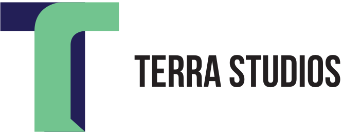

<!-- Format: ![Terra Studios Logo Header] -->

# Bootcamp Project: Terra Studio

This is where you put a small description of what the project is.

## Description

In late 2019, four friends got together and formed a design company that wanted to help make a change. Most people are focused on changing their companies for environmental purposes by ... etc etc etc

## Getting Started

### Dependencies
<!-- * Describe any prerequisites, libraries, OS version, etc., needed before installing program. -->
* Windows 10
* HTML5
* CSS3
* Javascript
<!-- * Be sure to prefix any bleeding-edge rules, tags, etc. (see [caniuse](https://caniuse.com/) for reference)
* Also using lastest ES6/next, you should probably think about including [Babel](https://babeljs.io/) for transpilation (or an NPM Script) -->

### Installing

* cd to the directory of your choice
* git clone the repository link to your directory
* Edit and assess!

## Authors

Contributors names and contact info

* Alec Riddick
	* [Website](http://www.chroniclesofriddickdesign.com/)
* Nour Al-Osman
* Gahyun (Stella) Lee
* Hyeryn Kim

## License

* MIT

## Acknowledgments

* [awesome-readme](https://github.com/matiassingers/awesome-readme)
* [PurpleBooth](https://gist.github.com/PurpleBooth/109311bb0361f32d87a2)
* [README Formatting](https://guides.github.com/features/mastering-markdown/)
* Stock Video
	* [Cityscape View](https://www.pexels.com/video/view-of-city-at-dusk-2019781/)
* Stock Music
	* [Above the Clouds](https://www.free-stock-music.com/fm-freemusic-above-the-clouds.html)